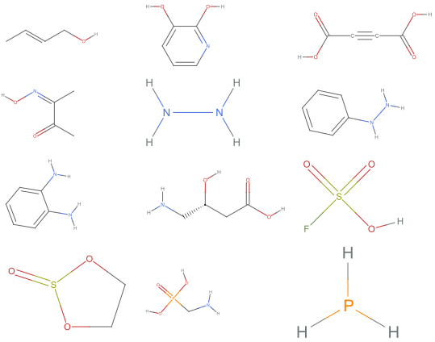

# 非分子结构化编程语

非分子结构化编程语是一种**深奥编程语言**([Esolang](https://en.wikipedia.org/wiki/Esoteric_programming_language)), 以下简称 NMSL.

NMSL 的程序由一串化学表达式构成.

如下是一个合法的 NMSL 的 `"Hello world!"` 程序




阅读顺序是从左往右, 从上往下读, 其 SMILES 转写为:

```js
C/C=C/CO
CC(=O)/C(C)=N\O
Nc1ccccc1N
O=S1OCCO1
Oc1cccnc1O
NN
NC[C@H](O)CC(=O)O
NCP(=O)(O)O
O=C(O)C#CC(=O)O
NNc1ccccc1
O=S(=O)(O)F
P
```

## 核心算法

如果一行由空白字符开头, 那么这是一句注释.

### 质量字节转换

每个粒子的分子量下取整获得一个大整数, 写出其 256 进制表示.

- `0 => [0]`
  - `e+`
- `255 => [255]`
  - `O=c1[nH]c2ncc(Br)nc2n1C1CC1`
- `256 => [1, 0]`
  - `Cc1[nH]c2ccc(F)cc2c(=O)c1Br`
- `1926 => [7, 134]`
  - `CN[C@H](CC(C)C)C(=O)N[C@H]1C(=O)N[C@@H](CC(N)=O)C(=O)N[C@H]2C(=O)N[C@H]3C(=O)NC(C(=O)N[C@@H](C(=O)NC(=O)[C@H](Cc4ccc(O)cc4)NC(=O)[C@H](Cc4c[nH]c5ccccc45)NC(=O)[C@@H](N)CCC(=O)O)c4cc(O)cc(O)c4-c4cc3ccc4O)[C@H](O[C@H]3C[C@](C)(N)[C@@H](O)[C@H](C)O3)c3ccc(c(Cl)c3)Oc3cc2cc(c3O[C@@H]2O[C@H](CO)[C@@H](O)[C@H](O)[C@H]2O)Oc2ccc(cc2Cl)[C@H]1O`

连接所有的字节得到一个字节串.

> 注意: 负质量视为0, 虽然现在没有发现这种粒子, 但是如果有的话就视为零.


### 电位编码模式

电位分为:

- 正电: 电荷数加和是正数
- 中性: 电荷数加和是零值
- 负电: 电荷数加和是负数

辨别每一个粒子的电位, 比如首个粒子是中性, 那就是 UTF8 模式, 正电就是数字模式

负电表示无法辨别, 读取下一粒子的电位

> 注意: 电荷数可以是分数, 比如上夸克电荷为 2/3 , 下夸克为 -1/3 

